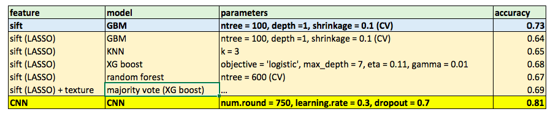

# Project: Labradoodle or Fried Chicken? In Blakc and White. 


### [Full Project Description](doc/project3_desc.html)

Term: Spring 2017

+ Team # 14
+ Team members
	+ Han, Ke kh2793@columbia.edu
	+ Li, Mengchen ml3890@columbia.edu
	+ Mison, Virgile vcm2114@columbia.edu
	+ Pan, Yijia yp2424@columbia.edu
	+ Xiang, Yi yx2365@columbia.edu

+ Project summary: In this project, we try to propose a feasible improvement on the currant classification engine to classify poodle dogs and fried chicken in terms of running cost (storage, memory and time) and prediction accuracy. The baseline model uses gradient boosting machine (gbm) on 5000 SIFT features. Our advanced model uses CNN and deep learning method which enhance the accuracy rate by 7%.

+ Image processing and features extraction: Baseline model using orignial 5000 SIFT features. Advanced model uses CNN and deap learning methods to extract the features and classify them.

+ Classification methods: Baseline model uses gbm method. Advance model uses CNN and deap learning. 

+ Model evaluation and comparison: First, the baseline model uses gradient boosting machine (gbm) on 5000 SIFT features. Second, we tried to choosing 5000 SIFT features using LASSO method. Then using several machine learning methods including random forest, knn, xgboost, logistic regression, svm to classify these images. However we didn't get a good result. At last, our advanced model uses CNN and deep learning method which enhance the accuracy rate by 7%.



**Contribution statement**: ([default](doc/a_note_on_contributions.md)) All team members contributed equally in all stages of this project. All team members approve our work presented in this GitHub repository including this contributions statement. 

Following [suggestions](http://nicercode.github.io/blog/2013-04-05-projects/) by [RICH FITZJOHN](http://nicercode.github.io/about/#Team) (@richfitz). This folder is orgarnized as follows.

```
proj/
├── lib/
├── data/
├── doc/
├── figs/
└── output/
```

Please see each subfolder for a README file.
